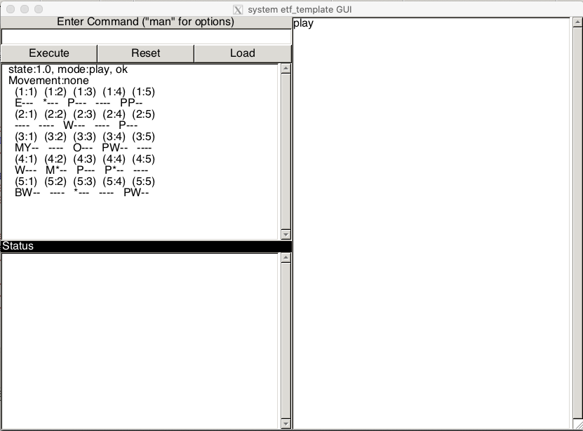
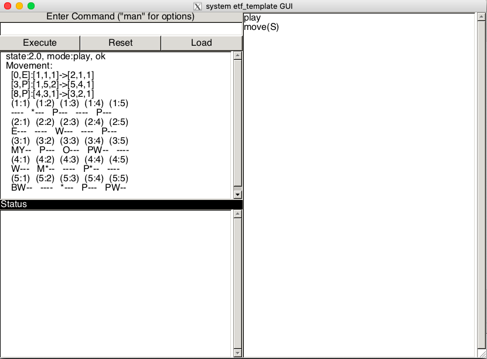
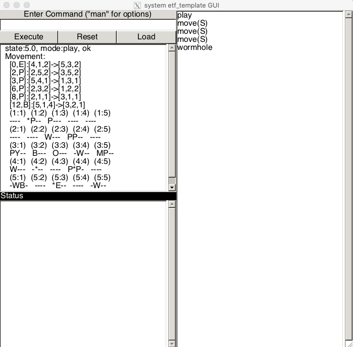
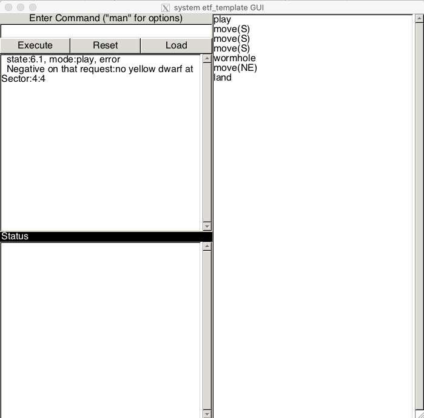
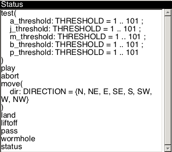

# Space-Odyessy-Game
A space odyessy game created in Eiffel using OOP and Software design principles.

Game Features:
- test
- play
- move ('N', 'NE','S', 'SE','E','SW','W','NW')
- solve
- land
- liftoff
- pass
- wormhole
- status
- abort

Project Images:

